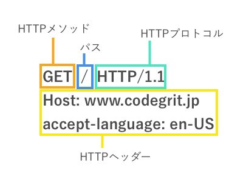
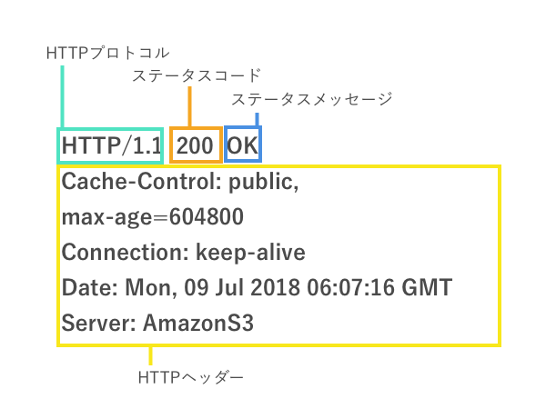

# Lesson 3. クライアント、サーバー間のコミュニケーション

## 目的

- HTTP通信の基本を理解する。
- Fetch APIを使えるようになる。

## HTTP

普段ウェブサイトへアクセスする際に何気なく打ち込んでいる`http`という文字ですが、これはHTTPプロトコルを用いて、httpの後に来るアドレスの場所から情報を取得することを意味しています。ここではHTTP通信の基礎を学んでいきましょう。

## HTTPプロトコル

HTTPとはHypertext Transfer Protocol の略です。HTMLがHyper Text Markup Languageだったことを覚えているかと思います。すなわち、HTMLで書かれたハイパーリンクを含むテキスト(ハイパーテキスト)をやり取りするための通信プロトコルという意味を持ちます。実際にはCSSファイル、Javascriptファイル、画像や動画などのやり取りもHTTP通信で行え、用途はHTMLファイルのやり取りに限定されませんのでクライントとサーバーのやり取りのための仕組みと理解して頂ければ大丈夫です。

HTTPは初期の0.9から現在主流であるバージョン1.1(HTTP1.1)、そして今後主流となるHTTP2のように複数のバージョンが存在しています。

## HTTP通信の基本

HTTP通信は、元々はWebブラウザとWebサーバーとのやり取りを行うために作られましたが、例えばネットに繋がっているロボットやスマート家電がサーバーと通信する際など幅広い用途で利用できます。通信は、サーバーとクラアントが直接やり取りする場合もありますが、多くの場合、間にモデムやルーター、ロードバランサーなど複数のコンピューター(これらをまとめてプロキシと呼びます。)を挟んで通信が行われます。

## HTTP通信の流れ

1. TCPコネクションを開く
2. HTTPリクエストを送信する
3. HTTPリスポンスを受信する
4. TCPコネクションを閉じる。あるいは同じTCPコネクションで次のリクエストを送信する。

* TCPはネットワーク通信の仕組みの一つです。現在はそういうものがあるのだなという程度の理解で問題ありません。

## HTTPメッセージ

HTTP通信の流れの部分で書いた、HTTPリクエストとHTTPリスポンスのことをHTTPメッセージと呼びます。

### HTTPリクエスト



HTTPリクエストは以下のような構造をしています。

- HTTPメソッド

HTTPメソッドはサーバーに対して、どのような操作を行うのか知らせるために使います。例えば、情報を取得したい場合には**GET**、データベースへの保存をしたい場合は**POST**、保存されているデータをアップデートしたい場合には**PUT**あるいは**PATCH**、データを消去したい場合は**DELETE**を使います。

- パス

パスはリクエストを送信するWebサーバーのURLを示します。

- バージョン

HTTPプロトコルのバージョンです。

- HTTPヘッダー

HTTPヘッダーにはサーバーへ送信する追加情報が含まれます。含まれる情報は例えば、リクエスト送信元(ホスト)の情報、認証、キャッシュ、Cookie、CORSなどに関する情報などです。これらについてはレッスン4以降でも触れていきます。

- HTTPボディ

例えば、HTTPメソッドでPOSTを利用してユーザーを登録したい際にはHTTPボディに名前やメールアドレスのような情報を含めてサーバーに送信することが出来ます。

### HTTPリスポンス



- ステータスコード、ステータスメッセージ

送信されたリクエストに対してどのような結果が返ってきたのかをコードで示します。例えば`200 OK`は成功を意味します。その他`403 Fobidden`はリソースの取得許可が得られない場合、`404 Not Found`はリクエスト先のURLが見つからない場合、`304 Not Modified`はリクエストしたリソースが更新されていないことを示します。

- HTTPヘッダー

HTTPリクエストと同様にHTTPリスポンスもヘッダーを含みます。

- HTTPボディ

HTTPボディは、取得したHTMLやCSS、画像のようなリソースを含みます。

### HTTPヘッダーに含まられる情報

HTTPヘッダーでよく利用するのが以下の3つのプロパティです。その他、情報は多岐に渡りこのレッスン内で全部は説明することが出来ないため、状況に合わせてMDNのリファレンスを参考にして下さい。

- Accept

AcceptはHTTPリクエストのヘッダー内に含めて、クライアント側でどのMIMEタイプを理解出来るかをサーバーに知らせるために利用します。後ほど紹介する例では`application/json`と、入れてJSON形式のデータを理解できることをサーバーに伝えています。

- Content-Type

Content-TypeはリクエストのBodyに含まれているコンテンツの形式をMIMEタイプを利用して表します。後ほど紹介する例では、`'application/json'`として、JSON形式のデータを送信することをサーバーに伝えています。

- Authorization

Authorizationは例えば、ユーザーがログインしているかどうかを判断したい時などに利用します。詳細はレッスン5で説明します。

### MIMEタイプについて

MIMEとはMultipurpose Internet Mail Extensionsの略で、ドキュメントのフォーマットを表現するために利用します。

#### MIMEタイプのシンタックス

MIMEタイプの構造は非常にシンプルで、以下のようにタイプとサブタイプを組み合わせて表現します。

`タイプ/サブタイプ`

例:

- text/plain - テキスト形式のデータを表します。
- text/html - HTML形式のデータを表します。
- text/css - CSS形式のデータを表します。
- text/javascript - Javascript形式のデータを表します。
- image/jpeg - jpeg形式のデータを表します。
- video/mp4 - mp4形式のデータを表します。
- application/json - JSON形式のデータを表します。


## AjaxとXMLHttpRequest

最近では、ページ全体を更新するのではなく、ページの一部分だけがアップデートされているサイトが大部分を増えています。例えばFacebookやTwitter、Instagramでは画面を下にスクロールしていくと新しい投稿情報のみを読み込んで表示します。こうしたことは2005年以前はまだ一般的ではありませんでしたが、2005年にGoogle Mapsがリリースされ、その中でAjaxという仕組みを用いてマップの一部分を更新されていたことで一躍脚光を浴びました。

### Ajax

Ajaxとは"Asynchronous JavaScript And XML"の頭文字を取ったものでJavascriptでの非同期通信を通してXML形式のデータを取得することを意味します。ただ、その後HTTPと似たように、非同期通信でデータを取得すること自体をAjaxと呼ぶようになり、現在ではXMLでは後述するJSON形式でデータを取得することが一般的となっています。

### XMLHttpReqeust(XHR)

Ajaxは元々XMLHttpRequest APIを利用して実装されました。XMLHttpRequestを利用したAjax通信は以下のような手順で実施されます。

1. クライアント側でXMLHttpRequestオブジェクトを作成する。
2. 作成したオブジェクトをHTTPリクエストに含めてサーバーに送信する。
3. サーバー側でXMLHttpRequestオブジェクトに要求されたデータをXMLまたはHTML形式で返します。
4. クライアント側で受け取った情報を処理する。

以下はXMLHttpReqestの例です。

```javascript
const endpoint = "http://localhost:3000" // サーバーのURL

const getUser = (userId) => {
  return new Promise((resolve, reject) => {
    const xhr = new XMLHttpRequest(); // ①
    const url = `${endpoint}/users/${userId}`; // ②
    xhr.onload = (e) => {
      if (xhr.status === 200) {
        resolve(xhr.response);
      } else {
        reject(JSON.parse(xhr.response));
      }
    }
    xhr.open("GET", url, true); // ③
    xhr.send();
  });
}

{
  getUser(1)
    .then((data) => {
      const p = document.createElement('p')
      p.innerHTML = data
      document.body.appendChild(p);
    })
    .catch((err) => {
      console.log(err.error);
    });
}
```

① XMLHttpRequstオブジェクトをまず作成しています。
② Userの情報をJSON形式で受け取るために、サーバーのURLを指定しています。
③ GETメソッドを利用してサーバーから情報を取得します。3つ目の引数の`true`は非同期でこのリクエストを処理することを意味します。XMLHttpRequestは同期的に行うことも出来ますがこれは非推奨です。

**XHRのサンプルコードはこちら**
[js-unit02-lesson03-sample01](https://github.com/codegrit-jp-students/js-unit02-lesson03-sample01)

## JSON

さて、上記のXMLHttpRequestの例ではJSONというデータ形式でデータをサーバーから取得しました。JSONとはJavaScript Object Notationの略です。JavaScriptと付いている通り、JavaScriptと親和性が高いため、Ajaxでのデータ通信でよく使われます。

JSONは以下のように記述します。

```json
"users": [
  {
    "id": 1,
    "name": "Steve Jobs",
    "bio": "Co-founer of Apple, Inc."
  },
  {
    "id": 2,
    "name": "Elon Musk",
    "bio": "CEO of Tesla Mortors."

  }
]
```

上記のように、JSONにはArray形式のデータも記述することが出来、各データは{"要素": "値"}という形式で記述します。

同じデータをJavascriptオブジェクトとして記述すると以下のようになります。

```javascript
const users = {
  users: [
    {
      id: 1,
      name: "Steve Jobs",
      bio: "Co-founer of Apple, Inc."
    },
    {
      id: 2,
      name: "Elon Musk",
      bio: "CEO of Tesla Mortors."
    }
  ]
}
```

ご覧の通り、ほとんど同じですね。Javascriptは以下のようにして簡単にJSONへと返還することが出来ます。

```javascript
let jsonData = JSON.stringify(users);
console.log(users); 
// => {"users":[{"id":1,"name":"Steve Jobs","bio":"Co-founer of Apple, Inc."},{"id":2,"name":"Elon Musk","bio":"CEO of Tesla Mortors."}]}
```

また、JSON形式のStringデータは以下のようにしてJavascriptオブジェクトへと返還出来ます。

```javascript
let userObj = JSON.parse(jsonData);
console.log(userObj);
/* 
{
  users: [
    {
      id: 1,
      name: "Steve Jobs",
      bio: "Co-founer of Apple, Inc."
    },
    {
      id: 2,
      name: "Elon Musk",
      bio: "CEO of Tesla Mortors."
    }
  ]
}
*/
```

そのため、サーバーからJSON形式のデータを受け取った場合、データをオブジェクトに変換することで簡単に各プロパティにアクセスすることが出来ます。

```javascript
let steve = userObj.users[0];
console.log(steve.name);
// => "Steve Jobs"
```

## Fetch API

Fetch APIはXMLHttpRequestと同様にサーバーからデータを取得するための仕組みです。XMLHttpRequestに比べてリクエストの送信や、リスポンスの扱いが容易なため、XMLHttpRequestではなくFetchを利用するのが現在は主流となっています。

### Fetchのシンタックス

fetchファンクションは以下のように書きます。

```javascript
fetch(URL)

// または

fetch(URL, initオブジェクト);
```

fetchファンクションはPromiseオブジェクトを返します。

```javascript
fetch("https://example.com/users/1")
  .then((response) => {
    // fetch成功
  })
  .catch((error) => {
    // fetch失敗
  });
```

### JSONデータをGETメソッドを利用して取得する例

先ほどXMLHttpRequestの項目で書いたgetUserメソッドをfetchを使って書くと以下のようになります。

**Fetchのサンプルコードはこちら**
[js-unit02-lesson03-sample02](https://github.com/codegrit-jp-students/js-unit02-lesson03-sample02)


```javascript
const endpoint = "http://localhost:3000" // サーバーのURL

const getUser = async (userId) => {
  const url = `${endpoint}/users/${userId}`;
  const response = await fetch(url, { method: "get" })
  const json = response.json();
  if (response.status === 200) {
    return Promise.resolve(json);
  } else {
    return Promise.reject(json.error);
  }
}

{
  getUser(1)
    .then((data) => {
      console.log(data);
      const p = document.createElement('p')
      p.innerHTML = `名前: ${data.name}<br/>メールアドレス: ${data.email} `
      document.body.appendChild(p);
    })
    .catch((err) => {
      console.log(err);
    });
}

```

### Initオブジェクト

fetchファンクションの2つ目の引数にはinitオブジェクトを指定できます。

initオブジェクトは例えば、ログインリクエストを送信するときには以下のように書くことが出来ます。

```javascript
const initObj = {
  method: "POST",
  mode: 'cors', 
  cache: 'default',
  headers: { // HTTPリクエスト内のHeaderに含める情報を指定する
    'Accept': 'application/json',
    'Content-Type': 'application/json'
  },
  body: JSON.stringify({ // HTTPリクエスト内のBodyに含める情報を指定する
    email: "example@codegrit.jp",
    rawPassword: "rawpassword"
  })
}
```

### Headersオブジェクト

initオブジェクト内のheadersの指定は、通常のJavascriptオブジェクトを利用する方法と、Headersオブジェクトを利用する2つの方法があります。

#### Headersオブジェクトの作成と操作

Headersオブジェクトは以下のようにして作成と操作が出来ます。

```javascript
let myHeaders1 = new Header(); // 空のHeaderオブジェクトの作成

myHeaders.append('Accept', 'application/json'); // Acceptキーと値の設定
myHeaders.get('Accept') // => 'application/json'; // キーを元に値を得る
myHeaders.set('Accept', 'text/html') // => 既に設定されている値を変更する
myHeaders.delete('Accept', 'application/json'); // => キーと値を消去する

let myHeaders2 = new Header({
  'Accept': 'application/json',
  'Content-Type': 'application/json'
}) // Headerオブジェクトの生成と同時にキーと値を設定する。
```

### Body mixin

Body mixinはFetch APIのリクエストとリスポンスのBody部分を読み取るためのプロパティとメソッド郡です。Fetch APIのリクエストとリスポンス双方にBody mixinは実装されています。(これはつまり、Body.json()というメソッドはresponse.json()、あるいはrequest.json()のように利用できることを意味します。プロパティの場合はrequest.bodyあるいはresponse.bodyのようにします。)

- Body.bodyプロパティ

Body部分のコンテンツを全て得ることが出来ます。

- Body.json()メソッド

Body部分をjsonとして読み取り、Promiseオブジェクトを返します。


### Fetchで得られるリスポンスオブジェクト

fetch成功時のPromiseオブジェクトにはリスポンスオブジェクトが含まれています。

リスポンスオブジェクトのプロパティは以下のようなものがあります。(全てはここに書かないので、必要な場合はMDNのドキュメントを参考にしてください。)

- response.headersプロパテイ

Headersオブジェクトです。

- response.statusプロパテイ

ステータスコードを返します。

- response.bodyプロパティ

リスポンスオブジェクトのBody部分を返します。

- response.json()メソッド

リスポンスオブジェクトのBody部分をJSONとして読み取り、Promiseオブジェクトを返します。

### POSTメソッドを利用する例

上述の通りPOSTメソッドはデータを保存したい場合に利用します。ここでは、ユーザー情報を保存することを想定してみます。

```javascript
const endpoint = "http://localhost:3000" // サーバーのURL

const logError = (error) => {
  console.log(error);
}

const status = (response) => {
  const json = response.json();
  if (response.status !== 200) {
    const error = new Error(json.error || json.message);
    return Promise.reject(error);
  }
  return Promise.resolve(json);
}

const createUser = async (userData) => {
  const url = `${endpoint}/users/`
  const res = await fetch(url, {
    method: 'post',
    headers: {
      'Accept': 'application/json',
      'Content-Type': 'application/json'
    },
    body: JSON.stringify(userData);
  })
  return res.then(status)
}

{
  let userData = {
    name: "Naoki Hanzawa",
    email: "hanzawa@tokyo-chuou-bank.jp",
    rawPassword: "naokihanzawa"
  }

  createUser(userData)
    .then((json) => {
      console.log(JSON.parse(json));
    })
    .catch(logError)
}

```

## CORS(HTTP access control)

Ajaxリクエストを利用するとサーバーから情報を取得することができますが、サーバーに誰でもアクセス出来てしまうと、セキュリティに問題が有ります。そのため、許可されたユーザーからのみアクセスが出来るようにする必要があります。これを実現するには次のレッスンで解説するHTTP authenticationと、CORSを利用します。CORSはcross-origin sharing standardの頭文字を取ったものです。

### same-origin policy

XMLHttpRequest、Fetch APIでは、デフォルトでsame-origin policyが適用されています。same-originとはどういうことかというと、プロトコル(httpあるいはhttps)、ホスト、ポートの全てが同じであることを指します。ホストとは例えばURLが https://www.codegrit.jp/ としたときの www.codegrit.jp の部分を指します。

例えば、 https://www.codegrit.jp/login というURLからサーバーにfetchリクエストを出すことを考えてみます。するとサーバーのURLごとに以下の結果が出ます。

| URL | 結果 | 理由 |
| https://www.codegrit.jp/api/authentication/ | 成功 | |
| https://api.codegrit.jp/authentication/ | 失敗 | ホストが異なるため |
| http://www.codegrit.jp/api/authentication/ | 失敗 | プロトコルが異なるため |
| http://www.codegrit.jp:3000/api/authentication/ | 失敗 | ポートが異なるため |

異なるorigin(cross-originと呼びます)からのリクエストを許可するには、サーバー側の設定が必要です。例えばExpress.jsというフレームワークをサーバー側で使っている場合であれば以下のように設定することで、 `https://api.codegrit.jp/authentication/` へのリクエストを許可することが出来ます。

```javascript
const express = require('express');

const app = express();

app.use((req, res, next) => {
  res.header("Access-Control-Allow-Origin", "https://api.codegrit.jp");
  next();
});
...
```

CORSについてのより詳しい解説は、Javascriptコースの主題と離れるため割愛します。実際にサービスを公開する際にはよりCORSについて理解を深めておくことが、セキュリティの高いサービス運用に繋がりますので改めて勉強する必要があります。今の段階では、クライアント、サーバー間のやり取りのセキュリティを高めるためにCORSという仕組みがあるということを理解頂ければ大丈夫です。

## チャレンジ

- [チャレンジ3](./challenge/README.md)

## 更に学ぼう

### 記事で学ぶ

* [HTTPの概要 - Mozilla](https://developer.mozilla.org/ja/docs/Web/HTTP/Overview)
* [MIMEタイプ - Mozilla](https://developer.mozilla.org/ja/docs/Web/HTTP/Basics_of_HTTP/MIME_types)
* [Fetch 概説 - Mozilla](https://developer.mozilla.org/ja/docs/Web/API/Fetch_API/Using_Fetch)
* [JSON公式(日本語)](https://www.json.org/json-ja.html)
* [JSON - Mozilla](https://developer.mozilla.org/ja/docs/Web/JavaScript/Reference/Global_Objects/JSON)
* [オリジン間リソース共有 (CORS) - Mozilla](https://developer.mozilla.org/ja/docs/Web/HTTP/HTTP_access_control)