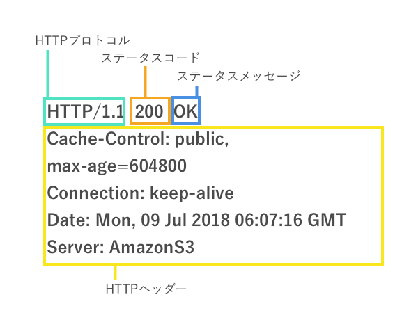

## HTTP

普段ウェブサイトへアクセスする際に何気なく打ち込んでいる`http`という文字ですが、これはHTTPプロトコルを用いて、httpの後に来るアドレスの場所から情報を取得することを意味しています。ここではHTTP通信の基礎を学んでいきましょう。

## HTTPプロトコル

HTTPとはHypertext Transfer Protocol の略です。HTMLがHyper Text Markup Languageだったことを覚えているかと思います。すなわち、HTMLで書かれたハイパーリンクを含むテキスト(ハイパーテキスト)をやり取りするための通信プロトコルという意味を持ちます。実際にはCSSファイル、Javascriptファイル、画像や動画などのやり取りもHTTP通信で行え、用途はHTMLファイルのやり取りに限定されませんのでクライントとサーバーのやり取りのための仕組みと理解して頂ければ大丈夫です。

HTTPは初期の0.9から現在主流であるバージョン1.1(HTTP1.1)、そして今後主流となるHTTP2のように複数のバージョンが存在しています。

## HTTP通信の基本

HTTP通信は、元々はWebブラウザとWebサーバーとのやり取りを行うために作られましたが、例えばネットに繋がっているロボットやスマート家電がサーバーと通信する際など幅広い用途で利用できます。通信は、サーバーとクラアントが直接やり取りする場合もありますが、多くの場合、間にモデムやルーター、ロードバランサーなど複数のコンピューター(これらをまとめてプロキシと呼びます。)を挟んで通信が行われます。

## HTTP通信の流れ

1. TCPコネクションを開く
2. HTTPリクエストを送信する
3. HTTPリスポンスを受信する
4. TCPコネクションを閉じる。あるいは同じTCPコネクションで次のリクエストを送信する。

* TCPはネットワーク通信の仕組みの一つです。現在はそういうものがあるのだなという程度の理解で問題ありません。

## HTTPメッセージ

HTTP通信の流れの部分で書いた、HTTPリクエストとHTTPリスポンスのことをHTTPメッセージと呼びます。

### HTTPリクエスト

HTTPリクエストは以下のような構造をしています。

- HTTPメソッド

HTTPメソッドはサーバーに対して、どのような操作を行うのか知らせるために使います。例えば、情報を取得したい場合には**GET**、データベースへの保存をしたい場合は**POST**、保存されているデータをアップデートしたい場合には**PUT**あるいは**PATCH**、データを消去したい場合は**DELETE**を使います。

- パス

パスはリクエストを送信するWebサーバーのURLを示します。

- バージョン

HTTPプロトコルのバージョンです。

- HTTPヘッダー

HTTPヘッダーにはサーバーへ送信する追加情報が含まれます。含まれる情報は例えば、リクエスト送信元(ホスト)の情報、認証、キャッシュ、Cookie、CORSなどに関する情報などです。これらについてはレッスン4以降でも触れていきます。

- HTTPボディ

例えば、HTTPメソッドでPOSTを利用してユーザーを登録したい際にはHTTPボディに名前やメールアドレスのような情報を含めてサーバーに送信することが出来ます。

### HTTPリスポンス

- ステータスコード、ステータスメッセージ

送信されたリクエストに対してどのような結果が返ってきたのかをコードで示します。例えば`200 OK`は成功を意味します。その他`403 Fobidden`はリソースの取得許可が得られない場合、`404 Not Found`はリクエスト先のURLが見つからない場合、`304 Not Modified`はリクエストしたリソースが更新されていないことを示します。

- HTTPヘッダー

HTTPリクエストと同様にHTTPリスポンスもヘッダーを含みます。

- HTTPボディ

HTTPボディは、取得したHTMLやCSS、画像のようなリソースを含みます。

### HTTPヘッダーに含まられる情報

HTTPヘッダーでよく利用するのが以下の3つのプロパティです。その他、情報は多岐に渡りこのレッスン内で全部は説明することが出来ないため、状況に合わせてMDNのリファレンスを参考にして下さい。

- Accept

AcceptはHTTPリクエストのヘッダー内に含めて、クライアント側でどのMIMEタイプを理解出来るかをサーバーに知らせるために利用します。後ほど紹介する例では`application/json`と、入れてJSON形式のデータを理解できることをサーバーに伝えています。

- Content-Type

Content-TypeはリクエストのBodyに含まれているコンテンツの形式をMIMEタイプを利用して表します。後ほど紹介する例では、`'application/json'`として、JSON形式のデータを送信することをサーバーに伝えています。

- Authorization

Authorizationは例えば、ユーザーがログインしているかどうかを判断したい時などに利用します。詳細はレッスン5で説明します。

### MIMEタイプについて

MIMEとはMultipurpose Internet Mail Extensionsの略で、ドキュメントのフォーマットを表現するために利用します。

#### MIMEタイプのシンタックス

MIMEタイプの構造は非常にシンプルで、以下のようにタイプとサブタイプを組み合わせて表現します。

`タイプ/サブタイプ`

例:

- text/plain - テキスト形式のデータを表します。
- text/html - HTML形式のデータを表します。
- text/css - CSS形式のデータを表します。
- text/javascript - Javascript形式のデータを表します。
- image/jpeg - jpeg形式のデータを表します。
- video/mp4 - mp4形式のデータを表します。
- application/json - JSON形式のデータを表します。
